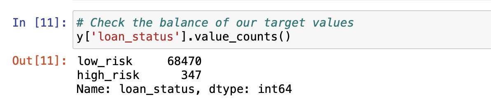

# Credit_loan_Analysis
Credit risk is an inherently unbalanced classification problem, as good loans easily outnumber risky loans.Using the credit card credit dataset from LendingClub, a peer-to-peer lending services company to analyzed it.

# Overview
The purpose of this analysis is to understand how to utilize Machine Learning statistical algorithms to make predictions based on data patterns provided. In this challenge, we focus on Supervised Learning using a free dataset from LendingClub, a P2P lending service company to evaluate and predict credit risk. This reason why this is called "Supervised Learning" is because the data includes a labeled outcome.

To complete this analysis, we use different Machine Learning techniques to train and evaluate the data with unbalanced classes. The dataset from the LendingClub has an unbalanced classification problem due to the number of good loans outweighing the amount of risky loans. We needed to employ various Machine Learning algorithms to resample the data. These algorithms include RandomOverSampler, SMOTE, ClusterCentroids, SMOTEENN, BalancedRandomForestClassifier, and EasyEnsembleClassifier.

# Results

As mentioned in the overview, we use Machine Learning to resample the dataset using Python libraries: scikit-learn and imbalanced-learn evaluate the results and provide a comparison for our analysis.

We used the "loan status" to determine whether the application was considered "low" or "high" risk. Applications that had "current" as the "loan status" were classified as "low risk" and the remaining as "high risk". This reduced the dataset to 68,817 total applications with 99% classified as "low risk".

Using the 75/25% method to split the data for training vs. testing, 51,352 "low risk" and 260 "high risk" applications were categorized into the training set.

## Oversampling
RandomOverSampler Model randomly selects from the minority class and adds it to the training set until both classifications are equal.

* Balanced accuracy score: 64%.

* Low Risk" had a precision rate of 100% and recall at 66%

* High Risk has recall of 62%

SMOTE (Synthetic Minority Oversampling Technique) Model, like RandomOverSampler increases the size of the minority class by creating new values based on the value of the closest neighbors to the minority class instead of random selection.

* The balanced accuracy score improved slightly to 65.1%.

* Like RandomOverSampler, the "High Risk" precision rate again was only 1% with the recall degraded to 64% giving this model an F1 score of 2%.
* "Low Risk" had a precision rate of 100% and an improved recall at 65%.

## Undersampling
ClusterCentroids Model, an algorithm that identifies clusters of the majority class to generate synthetic data points that are representative of the clusters.
* Balanced accuracy score was lower than the oversampling models at 64.8%.

* "Low Risk" had a precision rate of 100% and with a lower recall at 46% compared to the oversampling models.

## Combination Sampling

SMOTEENN (Synthetic Minority Oversampling Technique + Edited NearestNeighbors) Model combines aspects of both oversampling and undersampling.

* The balanced accuracy score improved to 52.2% when using a combined sampling model.

* The "High Risk" precision rate did not improve was only 1%, however the recall increased to 76% giving this model an F1 score of 2%.

### Use Ensemble Classifiers to Predict Credit Risk

Compare two new Machine Learning models that reduce bias to predict credit risk. 

BalancedRandomForestClassifier Model, two trees of the same size and equal size to the minority class are constructed to represent one for the majority class and one for the minority class.

* The balanced accuracy score increased to 78.8% for this model.

* "Low Risk" still had a precision rate of 100% with the recall at 91%.
* The top feature by importance was "total_rec_prncp" at 7.4% of the total.

EasyEnsembleClassifier Model, a set of classifiers where individual decisions are combined to classify new examples.

The balanced accuracy score increased to 92.5% with this model.

* The "High Risk precision rate increased to 9% with the recall at 92% giving this model an F1 score of 14%.
* "Low Risk" still had a precision rate of 100% with the recall now at 94%.

# Summary
In reviewing all six models, the EasyEnsembleClassifer model yielded the best results with an accuracy rate of 92.5% and a 9% precision rate when predicting "High Risk candidates. The sensitivity rate (aka recall) was also the highest at 92% compared to the other models. 
Therefore, if a model needed to be recommended to perform this type of analysis, then this one would be the clear choice.
Ranking of models in descending order based on "High Risk" results:
* EasyEnsembleClassifer
* BalancedRandomForestClassifer
* SMOTE
* SMOTEENN
* RandomOverSampler
* ClusterCentroids